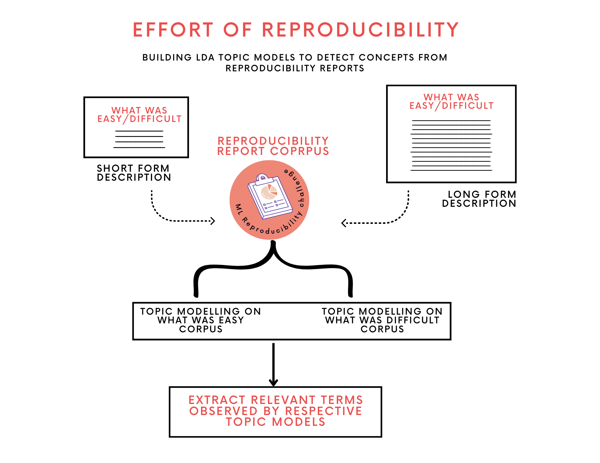

# effortly
A preliminary analysis of the effort required for reproducing computational science scholarly articles.

## About
The idea of estimating the underlying effort in reproducing scholarly articles is slightly new, and the [NIH article](https://www.ncbi.nlm.nih.gov/books/NBK350355/) serves as a good starting point to get some historical perspective on the topic. In an attempt to estimate "Effort in Reproducibility", we collected replication reports from **Machine Learning Reproducibility Challenge** ([2020](http://rescience.github.io/read/#volume-7-2021), [2021](http://rescience.github.io/read/#volume-8-2022)). The primary goal of **ML Reproducibility Challenge** was to have a community of researchers investigate the claims made in scholarly articles published at top conferences. The community selected papers and attempted to verify the claims made in the paper by reproducing computational experiments. The reports published on [ReScience](http://rescience.github.io/read/) were a by-product outlining the underlying effort behind reproducing the papers. We believe these reports to be a good starting point for understanding the operational framework of reproducibility. The reports had detailed information about the scope of reproducibility and what was easy and difficult for the researchers while replicating the original article.

## Overview


## Repository structure
```shell
├── data
│   ├── original-pdfs
│   ├── pdfs
│   │   ├── 10_5281-zenodo_1003214.pdf
│   │   ├── ...
│   │   ├── 10_5281-zenodo_890884.pdf
│   ├── ReScience.csv
│   ├── ReScience_JCDL-23.csv
│   ├── ReScience_ML_repro_challenge_alpha.csv
│   └── sciparse_outputs
│       ├── 10_5281-zenodo_1003214.json
│       ├── .........
│       ├── 10_5281-zenodo_1289889.json
├── LICENSE
├── media
│   ├── inductive_analysis.png
│   └── quantitative_analysis.png
├── notebooks
│   └── JCDL-23_Effort_of_Reproducibility.ipynb
├── README.md
├── slides
│   ├── JCDL'23 _ Effort of Reproducibility.pdf
│   └── JCDL'23 _ Effort of Reproducibility.pptx
└── src
    └── util.py

```

## Notebook
[](https://colab.research.google.com/github/reproducibilityproject/effortly/blob/main/notebooks/JCDL-23_Effort_of_Reproducibility.ipynb)


## Data Collection
In an effort to build a consolidated repository of datasets pertaining to reproducibility of scholarly articles, we initiated [reproducibility/datasets](https://github.com/reproducibilityproject/datasets/). The central idea here was to work towards studying "All things Reproducibility in Science". Data collection for [ReScience](http://rescience.github.io/read/) was a part of it and gathering the data was accomplished using methods from the following [util file](https://github.com/reproducibilityproject/datasets/blob/main/src/data.py).

## Data Description
The **Machine Learning Reproducibility Challenge** ([2020](http://rescience.github.io/read/#volume-7-2021), [2021](http://rescience.github.io/read/#volume-8-2022)) had a total of **87** articles, of which **15** were removed because they didn't belong to the discipline of machine learning. Additionally, two more articles were removed from the final dataset because they were editorials. The final dataset comprised of 70 articles and said analysis was made on these respective articles.

## Authors
[Akhil Pandey](https://github.com/akhilpandey95)

## PI, and Co-PI
[Hamed Alhoori](https://github.com/alhoori), [David Koop](https://github.com/dakoop)

## Acknowledgement
This work is supported in part by NSF Grant No. [2022443](https://www.nsf.gov/awardsearch/showAward?AWD_ID=2022443&HistoricalAwards=false).


## Citation
If you find this work useful, please cite our paper:

```bibtex
@article{akella2023JCDL,
  title={{Laying foundations to quantify the "Effort of Reproducibility"}},
  author={Akhil Pandey Akella and David Koop and Hamed Alhoori},
  journal={Proceedings of the 22nd ACM/IEEE Joint Conference on Digital Libraries (JCDL), ACM/IEEE},
  year={2023}
}